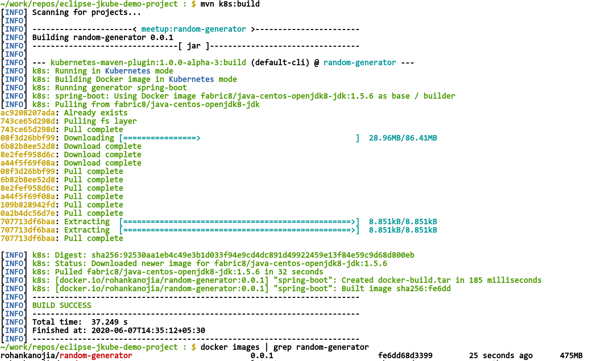
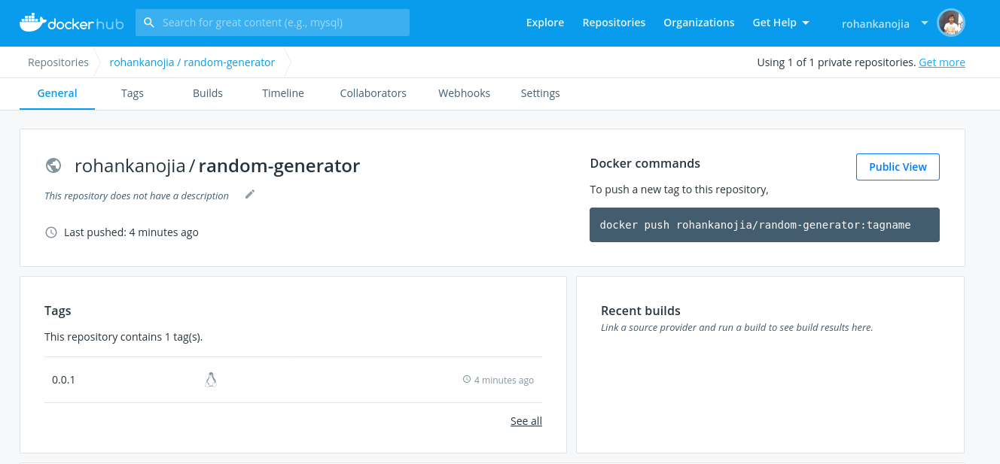
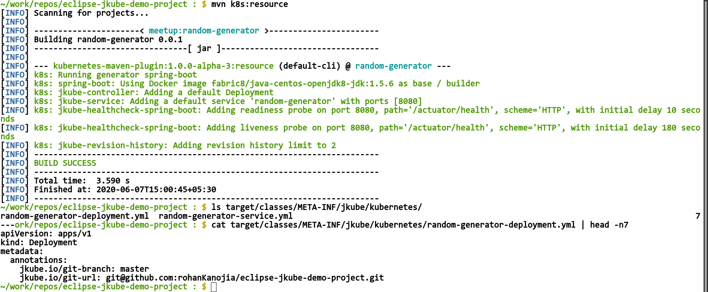
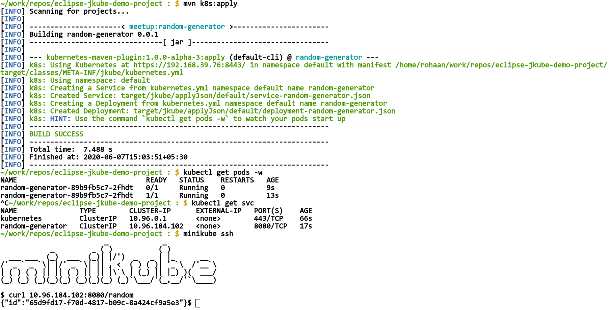

# Random Generator Application Demonstrating usage of Eclipse JKube for deploying onto Kubernetes

This is a simple random number generation application which just generates a random string on `/random` endpoint. It just
demonstrates usage of Eclipse JKube: https://github.com/eclipse/jkube

## How to build
Just run `mvn clean install`

## How to run
Do `mvn spring-boot:run`

After spring boot initializes, just do a `curl localhost:8080/random` to check endpoint.

## How to deploy application on Kubernetes?

### Building Docker image

  In order to build docker image of your application, you just have to make sure your docker deamon is running. If using
  minikube, you can simply do `eval $(minikube docker-env)` to expose docker deamon running inside minikube vm. Now in
  order to build simply issue:

  > mvn k8s:build



### Pushing your created Docker Image to some container registry

  Make sure you have your image name configured with respect to the registry you want to push to. In this case I would be pushing
  it to Docker Hub. I have added this property which overrides name of the Image being used:
  ```
  <properties>
      <jkube.generator.name>docker.io/rohankanojia/random-generator:${project.version}</jkube.generator.name>
  </properties>

  ```
  I have my registry setting being defined in my `~/.m2/settings.xml` like this:
 ```
<?xml version="1.0" encoding="UTF-8"?>
<settings xmlns="http://maven.apache.org/SETTINGS/1.0.0"
          xmlns:xsi="http://www.w3.org/2001/XMLSchema-instance"
          xsi:schemaLocation="http://maven.apache.org/SETTINGS/1.0.0 http://maven.apache.org/xsd/settings-1.0.0.xsd">
  <servers>
    <server>
      <id>docker.io</id>
      <username>rohankanojia</username>
      <password>password</password>
    </server>
  </servers>
</settings>

  ```
  > mvn k8s:push


   Once pushed you can see your image being pushed to Docker registry like this:



### Generating Kubernetes Manifests
  
  Once your image is built, you need to generate Kubernetes resource manifests for your Deployments, Service etc. To do
  it using Eclipse Jkube Kubernetes Maven Plugin just do:

> mvn k8s:resource



### Deploying application onto Kubernetes
  
  In order to deploy these generated manifests onto Kubernetes, just issue:

> mvn k8s:apply


  
  You'd observe they would be applied onto your Kubernetes Cluster. Right now Eclipse JKube has created a `Deployment` and a `Service` based on opinionated defaults. By default `Service` created is of type `ClusterIP`, which means it's only accessible from within the Kubernetes Cluster. That's why you see there is an ssh into minikube for accessing endpoint. If you want to access your application from outside the cluster you have to tell plugin to create service of type `NodePort` by specifying this property:
```
<properties>
    <jkube.enricher.jkube-service.type>NodePort</jkube.enricher.jkube-service.type>
</properties>
```
After that you can notice that `mvn k8s:resource` goal would generate `Service` of type `NodePort`. Here is how it would look like in action:


### CleanUp: Un-deploy your application from Kubernetes cluster

  If you want to un-deploy, we have this goal to delete all resources applied.

 > mvn k8s:undeploy


